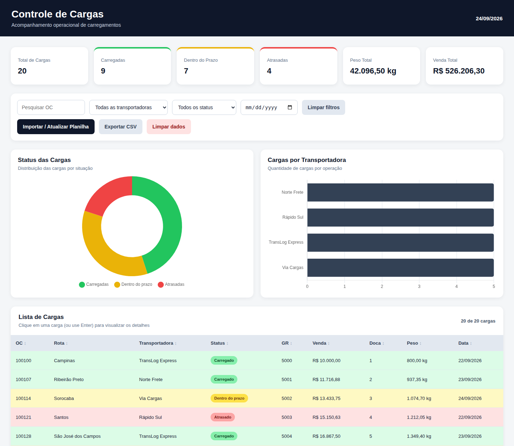
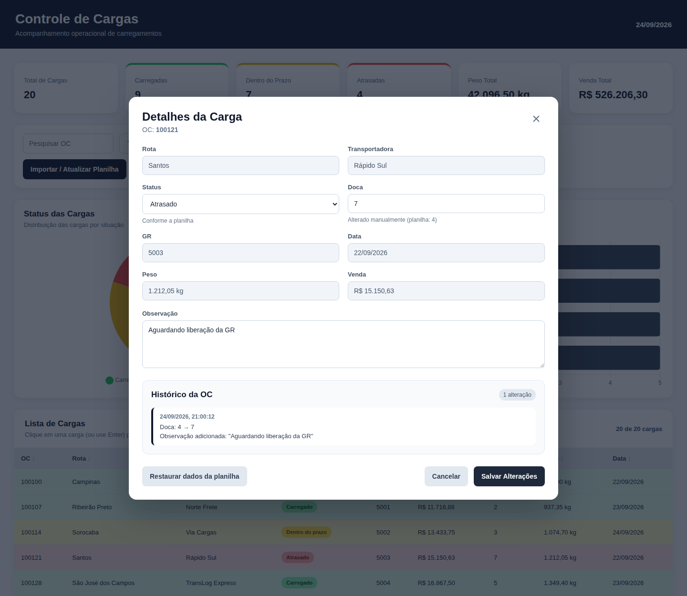

# 🚚 Controle de Cargas

[](https://github.com/MarcosPhilipe2/Controle-de-Cargas/actions/workflows/testes.yml)
[](LICENSE)

Dashboard web para **acompanhamento operacional de cargas**, desenvolvido com HTML, CSS e JavaScript a partir de um cenário prático de logística.

A aplicação transforma dados de uma planilha Excel em informações visuais para facilitar o acompanhamento da operação, reunindo **KPIs, filtros, gráficos, status, detalhes das cargas e histórico de alterações** em uma única interface.

> ⚠️ Todos os dados utilizados no projeto são fictícios e destinados exclusivamente a estudo, demonstração técnica e portfólio.



## 🎯 Objetivo

O projeto foi criado para explorar como uma rotina operacional baseada em planilhas pode evoluir para uma interface mais visual e interativa.

A proposta é centralizar informações de carregamento e permitir uma leitura rápida da operação, mantendo a planilha como fonte de dados nesta versão e deixando o projeto preparado conceitualmente para uma futura integração com banco de dados, API ou ERP.

## ✨ Funcionalidades

- Importação de arquivos `.xlsx` (a importação começa ao escolher o arquivo)
- Leitura dos dados com ExcelJS, incluindo células com **fórmulas, hiperlinks e texto formatado**
- Colunas localizadas **pelo nome do cabeçalho**, em qualquer ordem
- Identificação automática do status pela cor da célula (ou por uma coluna `Status` em texto)
- Pesquisa por OC e filtros por transportadora, status (incluindo **Sem status**) e data
- KPIs e gráficos atualizados conforme os filtros
- Tabela com **ordenação** por qualquer coluna
- Visualização detalhada de cada OC
- Alteração manual de status, doca e observações
- Indicação de quando um campo foi **alterado manualmente** e botão para **restaurar os dados da planilha**
- Histórico de alterações por OC
- Atualização da planilha sem perder alterações manuais, com resumo de cargas novas, atualizadas, removidas e duplicadas
- **Exportação para CSV** das cargas filtradas (abre direto no Excel)
- Botão para limpar os dados salvos no navegador
- Persistência local no navegador
- Acessível por teclado (Tab, Enter e Esc) e compatível com leitores de tela
- Layout responsivo (computador, tablet e celular)



## 📊 Indicadores

O painel apresenta:

- **Total de cargas**
- **Cargas carregadas**
- **Cargas dentro do prazo**
- **Cargas atrasadas**
- **Peso total**
- **Valor total das vendas**

## 📄 Formato da planilha

Há uma planilha pronta para teste em [`exemplo/cargas-exemplo.xlsx`](exemplo/cargas-exemplo.xlsx).

A primeira aba é lida e a **linha 1 deve conter o cabeçalho**. As colunas são reconhecidas pelo nome (sem diferenciar maiúsculas e acentos), em qualquer ordem:

| Campo          | Nomes aceitos no cabeçalho                       | Observação                            |
| -------------- | ------------------------------------------------ | ------------------------------------- |
| OC             | `OC`, `Ordem de Carga`, `Ordem`                  | Obrigatória; linhas sem OC são ignoradas |
| Rota           | `Rota`                                           |                                       |
| Transportadora | `Transportadora`, `Transp`, `Transporte`         |                                       |
| GR             | `GR`                                             |                                       |
| Venda          | `Venda`, `Valor`, `Valor Venda`, `Valor da Venda` | Aceita número, fórmula ou texto `1.234,56` |
| Doca           | `Doca`                                           | Aceita letras (ex.: `A2`)             |
| Peso           | `Peso`, `Peso KG`, `Peso (kg)`                   |                                       |
| Data           | `Data`, `Data Carregamento`, `Data de Carregamento` | Data do Excel ou texto `dd/mm/aaaa`  |
| Status         | `Status`, `Situação`                             | Opcional; tem prioridade sobre a cor  |

Se nenhuma coluna `OC` for encontrada no cabeçalho, é usado o layout fixo: **A** OC · **B** Rota · **C** Transportadora · **D** GR · **E** Venda · **F** Doca · **G** Peso · **H** Data.

## 🚦 Regras de status

O sistema interpreta a cor de preenchimento da célula da OC (ou, se ela não tiver cor, de outra célula da linha) e converte cada carga para um status operacional:

| Cor na planilha | Status          |
| --------------- | --------------- |
| 🟢 Verde        | Carregado       |
| 🟡 Amarelo      | Dentro do prazo |
| 🔴 Vermelho     | Atrasado        |

Além das cores padrão do Excel (`00B050`, `FFFF00`, `FF0000`), tons próximos também são reconhecidos. Cores não reconhecidas resultam em **Sem status**, e a quantidade aparece no resumo da importação.

> Cores aplicadas por **formatação condicional** ou por **cores do tema** do Excel não ficam gravadas na célula e, por isso, não podem ser lidas. Nesses casos, use uma coluna `Status` em texto.

### Alterações manuais x planilha

- Alterações manuais de status e doca são mantidas quando a mesma planilha é importada novamente.
- Se a **planilha mudar** o valor de um campo que tinha alteração manual, **o valor novo da planilha prevalece**, e a mudança fica registrada no histórico da OC.
- Observações nunca são sobrescritas pela planilha.

## 🧠 Fluxo da aplicação

```text
Planilha Excel (.xlsx)
        ↓
      ExcelJS
        ↓
Leitura e tratamento dos dados (utils.js)
        ↓
     JavaScript
        ↓
 ┌──────┼──────────┐
 ↓      ↓          ↓
KPIs  Gráficos   Tabela
                   ↓
          Detalhes da carga
                   ↓
       Alterações + Histórico
                   ↓
             LocalStorage
```

## 🛠️ Tecnologias

- **HTML5**: estrutura da aplicação
- **CSS3**: layout e identidade visual
- **JavaScript**: regras, filtros, indicadores e interações
- **ExcelJS 4.4**: leitura da planilha Excel
- **Chart.js 4.5**: geração dos gráficos
- **LocalStorage**: persistência local no navegador
- **Node.js (`node:test`)**: testes automatizados
- **Prettier**: padronização do código
- **GitHub Actions**: testes a cada envio
- **Git / GitHub**: versionamento

As bibliotecas são carregadas por CDN com **versão fixa e verificação de integridade (SRI)**.

## 📂 Estrutura

```text
Controle-de-Cargas/
├── index.html              # Estrutura: KPIs, filtros, gráficos, tabela e modal
├── style.css               # Layout responsivo, cores, tabela, modal e avisos
├── utils.js                # Regras de negócio (sem dependência da tela)
├── script.js               # Interface: eventos, renderização e persistência
├── exemplo/
│   └── cargas-exemplo.xlsx # Planilha fictícia para teste
├── docs/                   # Imagens do README
├── tests/
│   └── utils.test.js       # Testes das regras de negócio
└── package.json
```

`utils.js` concentra as regras (conversão de valores, datas, status por cor, mapeamento de colunas, mesclagem da importação, filtros, ordenação, indicadores e CSV). Por não depender do navegador, é testado diretamente no Node.

## ▶️ Como executar

Este é um projeto front-end e não exige instalação de dependências.

```bash
git clone https://github.com/MarcosPhilipe2/Controle-de-Cargas.git
cd Controle-de-Cargas
```

Depois, abra o arquivo `index.html` no navegador e importe a planilha `exemplo/cargas-exemplo.xlsx`.

É necessário acesso à internet para carregar ExcelJS e Chart.js pela CDN.

### Publicar no GitHub Pages

Em **Settings → Pages**, selecione a branch `main` e a pasta `/ (root)`. O painel ficará disponível em `https://marcosphilipe2.github.io/Controle-de-Cargas/`.

## 🧪 Testes

Requer Node.js 18 ou superior:

```bash
npm test
```

Os testes cobrem leitura de células (fórmulas, hiperlinks e texto formatado), conversão de números e datas (incluindo o fuso horário), reconhecimento de cores, mapeamento de colunas, mesclagem da importação com alterações manuais, filtros, ordenação, indicadores e exportação CSV.

## 💾 Persistência

O projeto utiliza o `localStorage` do navegador para manter:

- base de cargas importada;
- alterações manuais;
- histórico por OC.

Isso permite atualizar a página sem precisar importar novamente a planilha em todas as utilizações no mesmo navegador. O botão **Limpar dados** remove tudo.

> O `localStorage` é adequado para este protótipo, mas não substitui um banco de dados em uma aplicação multiusuário.

## 🔄 Evolução do projeto

Este projeto nasceu da ideia de transformar um acompanhamento operacional feito em planilha em uma aplicação mais visual.

Uma evolução natural seria substituir o armazenamento local e a importação manual por uma arquitetura com:

```text
ERP / Sistema Operacional
          ↓
         API
          ↓
     Banco de Dados
          ↓
 Aplicação / Dashboard
```

## 🗺️ Próximas evoluções

- Banco de dados centralizado
- API para atualização automática
- Integração com ERP
- Autenticação de usuários
- Perfis e permissões
- Identificação do usuário responsável por cada alteração
- Indicadores históricos
- Relatórios operacionais
- Indicadores de produtividade

## 💼 O que este projeto demonstra

Este projeto combina conhecimentos de desenvolvimento web com experiência prática em logística.

Entre os conceitos aplicados estão:

- manipulação de dados;
- leitura de arquivos Excel;
- regras de negócio separadas da interface;
- testes automatizados e integração contínua;
- segurança (prevenção de XSS e de injeção de fórmulas no CSV);
- acessibilidade;
- persistência no navegador;
- filtros, busca e ordenação;
- construção de dashboards;
- visualização de indicadores;
- organização de informações operacionais;
- versionamento com Git.

## 👨‍💻 Autor

**Marcos Philipe Tavares**

Projeto desenvolvido como parte do meu portfólio em Tecnologia, Dados e Automação, aplicando desenvolvimento web a um cenário de operação logística.

## 📄 Licença

Distribuído sob a licença MIT. Veja o arquivo [`LICENSE`](LICENSE) para mais detalhes.
